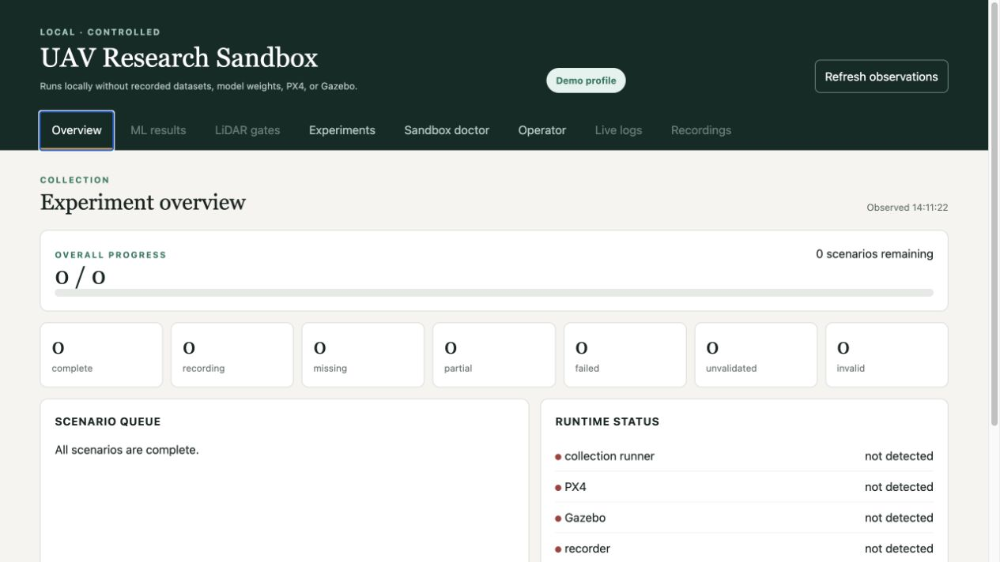

# Substation UAV ML Research Platform

> **Status: Sandbox v0.1 Candidate / Experimental Research Platform**
>
> This repository develops sensor-driven risk, traversability learning, and
> semantic inspection planning in simulation. It is not production software,
> does not include trained model weights, and has not been validated on a real
> airframe or energized substation.

The project extends the stable
[uav-path-planning-demo](https://github.com/Xieyizhou/uav-path-planning-demo)
baseline with Gazebo LiDAR, record/replay, local costmaps, ML/ONNX research
interfaces, deterministic camera collection, and visual model evaluation.




[Demo video](https://github.com/Xieyizhou/uav-path-planning-demo/releases/tag/v0.1-demo)
· [Command reference](docs/CLI_REFERENCE.md)
· [Architecture](docs/architecture.md)
· [Local sandbox app](docs/RESEARCH_INSPECTOR.md)
· [Sandbox quick start](docs/SANDBOX_QUICKSTART.md)
· [Experiment protocol](docs/EXPERIMENT_PROTOCOL.md)
· [ML research platform](docs/ML_RESEARCH_PLATFORM.md)
· [ML study workflow](docs/STUDY_WORKFLOW.md)
· [Research roadmap](ROADMAP.md)
· [Project provenance](PROVENANCE.md)

## Project Snapshot

| Area | Implementation |
| --- | --- |
| Autonomous planning | Height-aware A* routing, obstacle inflation, path simplification, and return-route generation |
| Flight execution | MAVSDK local-NED waypoint control against PX4 SITL and Gazebo |
| Risk response | Map-oracle baseline plus live/replayed 2D LiDAR costmaps, geometric risk, safety actions, and optional ONNX fusion |
| ML research | Reproducible randomized worlds, automatic LiDAR truth labels, versioned datasets/model packages, deterministic 1D CNN training, and resumable paired studies |
| Local replanning | Candidate-only evaluation and active replacement of remaining outbound waypoints |
| Test environments | 5 coordinated Gazebo/A* maps, 5 safe destination presets per map, and map/target switching |
| Evaluation | Structured telemetry, run manifests, plots, stage summaries, and cross-stage comparisons |
| Reliability | Explicit failure codes, timeout-bounded runtime tasks, landing confirmation, PID-scoped cleanup, and parameter validation |
| Developer experience | One modular `main.py` command center plus a local sandbox app for health checks, bounded jobs, recording review, and aggregate ML results |

## Selected Engineering Contributions

- Built an end-to-end autonomy pipeline from grid planning to simulated flight,
  telemetry collection, risk response, replanning, and experiment analysis.
- Kept the Gazebo world, PX4 spawn pose, A* obstacle grid, and selected
  destination synchronized through a validated map catalog.
- Designed five test environments ranging from a 16 × 16 m training yard to a
  dense 32 × 32 m multi-voltage station, with 25 validated destination presets.
- Added four reproducible experiment stages: static A*, perception response,
  log-only local replanning, and active route replacement.
- Hardened execution with connection, telemetry, waypoint, landing, and logger
  timeouts; atomic run-status records; confirmed landing state; and cleanup
  limited to project-managed processes.
- Refactored project execution into a small modular CLI while preserving
  advanced flight parameters and correct subprocess exit codes.

## Measured Simulation Results

The committed sample artifacts contain one selected landmark run from each
official stage:

| Stage | Flight time | Key result | Safety-buffer violations | Status |
| --- | ---: | --- | ---: | --- |
| Static A* | 149.316 s | Completed a 68 m planned round trip | 0 | PASS |
| Perception response | 174.563 s | 671 risk detections and 296 slow-down events | 0 | PASS |
| Replan log-only | 149.850 s | 4 successful candidates from 4 replan attempts | 0 | PASS |
| Active replan | 222.392 s | 3 successful replans and 1 active route replacement | 0 | PASS |

Source data: [comparison summary](data/sample_outputs/comparison_summary.md) and
[selected run metadata](data/sample_outputs/selected_runs.json).

The refreshed landmark uses active run `as_20260713_070842`. The latest three
eligible active-replan runs all pass strict target-switching validation with a
contiguous `RWP01` through `RWP06` sequence, no old outbound `WP` target after
replacement, original-goal arrival, and completed landing.

The aggregate comparison now includes 4 static, 3 perception-response, 3
log-only replan, and 6 active-replan runs. All 16 are completed and marked
`PASS`, with zero recorded safety-buffer violations. See the committed
[aggregate summary](data/sample_outputs/aggregate_summary.md).

### Live LiDAR v0.1 evidence

On 2026-07-28, the `x500_research` vehicle completed a 600-second LiDAR
stability capture in the held-out `extreme` world and six sensor-driven round
trips across the `complex` and `extreme` worlds. Each map used the `left`,
`center`, and `top_right` targets:

| Evidence | Result |
| --- | --- |
| Stability capture | 18,165 frames; 599.577 s sensor timestamp span; 30.295 Hz |
| Data health | 0 dropped or invalid frames; 11.56 ms P95 frame age |
| Closed-loop missions | 6/6 completed with confirmed landing |
| Safety result | 0 physical collisions; 0 inflated-buffer entries |
| In-flight LiDAR health | ≥99.82% healthy samples; ≤31.64 ms P95 frame age; 0 drops |
| Closed-loop flight time | 1,288.365 s total; 214.727 s mean |
| Geometric inference | ≤3.11 ms P95 across all six runs |

The capture command ran for 600 seconds; the timestamp span starts at the
first received scan. Raw scans, telemetry, simulator logs, and generated plots
remain outside Git. The exact run IDs, hashes, limitations, and per-target
metrics are recorded in the
[v0.1 LiDAR validation report](docs/results/v0.1_lidar_validation_20260728.md)
and its [machine-readable summary](data/sample_outputs/v0.1_lidar_validation_20260728.json).

## System Architecture

```text
Map + destination catalog
          ↓
Height-aware obstacle grid → A* global route → simplified waypoints
                                                ↓
Gazebo world ← PX4 SITL ← MAVSDK local-NED flight controller
                                                ↓
                         telemetry + map oracle / LiDAR perception
                                                ↓
                      risk action / local route replacement
                                                ↓
                    CSV logs → metrics → plots → comparisons
```

The project separates user commands, flight execution, planning, perception,
map management, and reporting into small modules under `src/`.

## Technology Stack

- Python 3.11, `asyncio`, `unittest`
- PX4 SITL, Gazebo Sim, MAVSDK
- A* search and grid-based obstacle modeling
- pandas and Matplotlib for telemetry analysis
- Bash experiment launchers and GitHub Actions offline validation
- JSON/SDF configuration for synchronized planning and simulation maps

## Quick Start: App Demo

The tracked Demo Profile runs with Python 3.11+ and does not require local
datasets, trained weights, PX4, Gazebo, or third-party Python packages:

```bash
git clone https://github.com/Xieyizhou/substation-uav-ml-research.git
cd substation-uav-ml-research
./scripts/run_sandbox_app.sh
```

Open `http://127.0.0.1:8765`, choose **Experiments**, and run **Demo
classifier**. The result is an identity-bound workflow example built from
synthetic features and is explicitly excluded from formal research evidence.

### Native macOS shell

The optional SwiftUI application manages the same loopback Sandbox service. A
native status page summarizes the active profile, environment checks, managed
job, runtime processes, and storage. The complete browser workbench remains
available in the same window:

```bash
./scripts/build_macos_app.sh release
open "dist/UAV Research Sandbox.app"
```

Create a versioned preview archive and SHA256 checksum with:

```bash
./scripts/package_macos_release.sh 0.2.0
```

It currently uses the repository's Python environment and keeps PX4/Gazebo as
external development dependencies. See [the macOS App guide](docs/MACOS_APP.md)
for profiles, build requirements, preview releases, and the distribution
boundary.

Run the complete offline release check with:

```bash
python3 main.py sandbox --profile demo release-gate \
  --output outputs/sandbox/demo/release-gate/local
```

Before publishing or reviewing a Beta, reproduce a first-time installation in
a tracked-source copy and fresh virtual environment:

```bash
python3 main.py sandbox --profile demo beta-install-gate \
  --output outputs/sandbox/demo/beta-install/local
```

This gate uses no network access. It runs bootstrap, the deterministic Demo,
receipt inspection, and a loopback App smoke check without using the current
virtual environment or local research data.

See the [Sandbox quick start](docs/SANDBOX_QUICKSTART.md) for profile boundaries,
outputs, and the first experiment walkthrough.

## Full Simulator Setup

Prerequisites: Python 3.11+, PX4 SITL/Gazebo, and a local
`~/PX4-Autopilot` checkout.

```bash
python3 -m venv .venv
source .venv/bin/activate
pip install -r requirements.txt
python main.py check environment
```

Select a map and destination:

```bash
python main.py map
python main.py point
```

Start PX4/Gazebo in terminal A:

```bash
python main.py map start
```

Preview or fly in terminal B:

```bash
source .venv/bin/activate
python main.py task run preview_route
python main.py task run fly_round_trip
```

Flight commands control PX4 SITL. Use the preview command first when testing a
new map or destination.

## Unified Command Center

```bash
python main.py --help

python main.py map list
python main.py point list
python main.py task list

python main.py astar preview --return-home
python main.py astar fly --return-home --max-speed 0.8

python main.py experiment run static
python main.py experiment run-all --trials 3

python main.py report summarize
python main.py report compare --mode both --min-runs-per-stage 3

python main.py check all

python main.py map start complex --vehicle-model x500_research
python main.py sensor check --source gazebo_lidar_2d
python main.py data --help
python main.py model --help
python main.py study --help
python main.py model protocol --config config/perception/research_protocol.json

python main.py sandbox serve --host 127.0.0.1 --port 8765
```

See [docs/CLI_REFERENCE.md](docs/CLI_REFERENCE.md) for every command and advanced
parameter-forwarding example.

## Repository Structure

| Path | Purpose |
| --- | --- |
| `main.py` | Unified user entry point |
| `src/cli/` | Modular command routing |
| `src/planner/` | A* search, obstacle conversion, and path simplification |
| `src/flight/` | MAVSDK flight runtime, task presets, and replanning orchestration |
| `src/perception/` | Simulated obstacle detector and risk-state logic |
| `src/sensors/` | Unified live/replay sensor sources and stable data contracts |
| `src/ml/` | LiDAR learning, generic dataset utilities, and non-visual model tooling |
| `src/vision/` | Camera contracts, collection, training views, evaluation, packaging, and static replay |
| `src/inspection/` | Read-only sandbox observations, recording browser, and aggregate ML lifecycle results |
| `src/sandbox/` | Allowlisted local jobs, single-instance control, bounded execution, and job history |
| `src/study/` | SQLite registry, tier matrices, resumable queues, gates, and paired statistics |
| `apps/macos/SandboxApp/` | Native SwiftUI shell for the controlled local Sandbox service |
| `src/maps/` | Map catalog, target selection, and Gazebo marker synchronization |
| `src/logging/` | Telemetry, metrics, plots, reports, and comparisons |
| `scripts/flight/experiments/` | Reproducible four-stage experiment launchers |
| `config/maps/` | Generated map-specific A* configurations |
| `simulation/worlds/` | Gazebo SDF test environments |
| `tests/` | Offline regression and safety tests |

## Verification

```bash
python main.py check perception
python main.py check replan
python main.py check maps
python main.py check tests
python main.py check all
```

The dependency-free suite covers CLI routing, map/target
alignment, A* reachability, parameter safety, exit-code propagation, timeout
behavior, landing confirmation, sensor parsing/replay, costmaps, dataset
isolation, visual replay, task presets,
goal-marker synchronization, and active-replan validation. PX4/Gazebo stability,
closed-loop flight, and model benchmarks remain separate research runs and are
not implied by a passing offline CI run.

## Scope and Limitations

- Simulation only; the system has not been validated on real UAV hardware.
- The legacy four-stage comparison artifacts use the map oracle. The separate
  v0.1 evidence above uses live Gazebo LiDAR with geometric risk; neither is a
  learned-perception result.
- Live/replayed 2D LiDAR, deterministic fault injection, automatic truth
  labels, ONNX packaging, and the 120-run paired study registry are
  implemented. No trained model or statistically complete 30-seed benchmark
  is committed.
- YOLO collection, training, evaluation, and replay are research components;
  they still require frozen data, trained weights, and staged integration runs.
- Reproducible unknown static obstacles, equipment pose/scale variation, scan
  noise/dropout, stream outage, and attitude-label jitter are implemented.
  Their formal closed-loop comparison is still pending.
- Active route replacement has passed repeated target-switching validation on
  the simple map, but still needs cross-map and dynamic-obstacle validation.
- The committed results are selected demonstration runs, not a statistical
  performance claim.

## Resume-Ready Summary

- Engineered a PX4/Gazebo UAV autonomy pipeline integrating A* route planning,
  MAVSDK waypoint control, simulated perception, telemetry analysis, and local
  route replanning across five substation test environments.
- Developed a four-stage experimental framework with structured logs,
  reproducible reports, and safety-aware runtime controls; measured an average
  of 300 perception-triggered slow-down events across three response runs and
  validated active route replacement in simulation with zero recorded
  safety-buffer violations across 16 analyzed runs.
- Improved maintainability and reliability through a unified modular CLI, 25
  validated target presets, bounded asynchronous cleanup, explicit failure
  propagation, and automated offline safety and research-contract tests.
