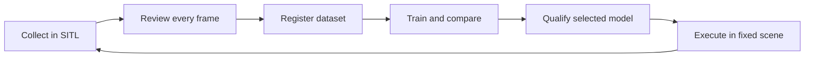

<div align="center">

# UAV Research Sandbox

**A desktop workspace for substation UAV simulation and visual model research.**

Plan a route · Collect feedback · Review labels · Train and compare · Fly in SITL

[](https://github.com/Xieyizhou/substation-uav-ml-research/actions/workflows/ci.yml)


[](LICENSE)

[Quick start](#try-the-demo) · [中文说明](README.zh-CN.md) · [Workflow guide](docs/VALIDATION.md) · [CLI reference](docs/CLI_REFERENCE.md) · [Project status](PROJECT_STATUS.md)

</div>


*Actual desktop capture from the September 25, 2026 local acceptance run. The model,
datasets and flight receipts shown here are local research artifacts, not bundled demo data.*

## What this project is

A local research sandbox connecting **PX4 SITL and Gazebo simulation**, **A* route
planning**, and **visual model iteration**. Use the desktop browser workspace or
the optional macOS shell; the same managed workflows are available through the CLI.

This is a **research preview**. The dependency-free Demo is ready to explore;
training and flight need separately installed tools and supplied research assets.
The project has not been validated on real aircraft or energized substations.

## Explore the workspace

| Workspace | What you can do |
| --- | --- |
| **Map Studio** | Edit a substation layout, check routes and freeze an immutable map revision. |
| **Flight Console** | Run managed simulation tasks, inspect trajectories, and request a controlled stop and landing. |
| **Dataset Manager** | Inspect collected frames, explicitly accept or reject labels, and register a versioned dataset. |
| **Training Studio** | Run bounded YOLO experiments, fine-tune a verified parent and export ONNX. |
| **Model Tester** | Inspect verified candidates and compare local-image predictions; native image import is available in the macOS shell. |
| **Report Viewer** | Inspect evaluation results, job logs and identity-bound receipts. |

The current model feedback loop is:



Predictions are review drafts, not automatic ground truth. A selected model needs
both a complete-task check and an in-motion controlled-stop check for the current
runtime identity. Changes to the bound code, model or runtime require new checks.
Custom-map flight and the qualified fixed-scene model task are separate workflows.

## Try the Demo

**Requirements:** Git, Python 3.11+ and a desktop browser on macOS or Linux.
No Python packages, trained weights, datasets, PX4 or Gazebo are needed for Demo.

```sh
git clone https://github.com/Xieyizhou/substation-uav-ml-research.git
cd substation-uav-ml-research
./scripts/run_sandbox_app.sh
```

Open **[localhost:8765](http://127.0.0.1:8765/#results/acceptance)** →
**Acceptance** → **Demo classifier** → **Create recipe and run**.
The deterministic synthetic example demonstrates recipes and receipts; it does
not measure detector quality. Press `Ctrl-C` in the terminal to stop the server.

For a terminal-only run:

```sh
python3 main.py sandbox --profile demo demo-run --output outputs/sandbox/demo/runs/first
python3 main.py sandbox --profile demo demo-inspect --input outputs/sandbox/demo/runs/first
```

[First-run guide and troubleshooting →](docs/SANDBOX_QUICKSTART.md)

## Choose a research setup

| Mode | Additional requirements | Scope |
| --- | --- | --- |
| **Demo** | None beyond Python | Synthetic workflow tour; no flight or real YOLO training. |
| **Development · offline** | Core + ML dependencies and your own reviewed YOLO dataset | Training, ONNX checks, replay and comparison. |
| **Development · simulation** | Compatible PX4/Gazebo, required model/data and scenario assets | Map flight, collection and the fixed-scene feedback loop. |
| **Formal** | Frozen artifacts and the matching experiment protocol | Evidence-preserving evaluation; not an aircraft certification. |

Start a development environment:

```sh
python3 -m venv .venv
source .venv/bin/activate
python -m pip install -r requirements.txt
# Optional: install before using real visual training; see the compatibility guide.
python -m pip install -r requirements-ml.txt
./scripts/run_sandbox_app.sh --profile development
```

The ML pins were validated locally on **Python 3.14 / macOS arm64**; that is
separate from the Demo and core CI matrix. A source clone does **not** include
trained weights, raw datasets, PX4/Gazebo, or the local frozen evidence archive.
Some advanced workflows therefore remain unavailable until their inputs are
provided. There is no automatic download of the author's research environment.

[Setup and artifact boundaries](docs/RESEARCH_PREVIEW.md) ·
[Dataset import and training](docs/RESEARCH_INSPECTOR.md) ·
[Current model qualification](docs/VALIDATION.md#桌面反馈迭代)

### Optional macOS app

With a full Xcode installation, build the native shell from this checkout:

```sh
./scripts/build_macos_app.sh release
open "dist/UAV Research Sandbox.app"
```

The native Demo can run without a repository or Python. Development and Formal
use an external Python/simulator environment. Local builds are ad-hoc signed,
not Apple-notarized. Existing older prerelease binaries do not necessarily match
this source snapshot; see the [macOS guide](docs/MACOS_APP.md).

## What has been verified

| Evidence | Result and boundary |
| --- | --- |
| Portable core, September 25 | **974 tests passed** in an independently unpacked source tree with core test dependencies and no ML stack. Current CI is linked above. |
| Full local research environment, September 25 | **2,093 tests passed**. Research checks require local artifacts and are separate from source-only CI. |
| Desktop feedback loop | Collected 51 frames; AI-assisted explicit review accepted 46 and rejected 5; registered, fine-tuned, compared and flew the selected model in the existing fixed scene. |
| Model comparison | Parent macro-F1 **0.970238 → 0.968013** on the same 64-image development validation set. The new model did **not** improve this metric. |
| Runtime checks | Complete-task and controlled-stop checks passed. One later task aborted during visual revalidation and landed safely; an unchanged retry completed. No statistical success-rate claim. |
| Historical evidence | 50 original records were reverified from a portable archive. These records do not qualify changed code or models. |

[Acceptance report and exact identities →](docs/results/sandbox_core_completion_20260925.md)

**Known limits:** simulation only; desktop only; no demonstrated real-image
transfer or real-airframe readiness. The reviewed feedback used AI assistance,
not independent human annotation. The retained base validation split is not
proof of independence across physical sites. Historical selected runs are not
universal performance guarantees.

<details>
<summary>Earlier research results and their evidence boundaries</summary>

- [Live LiDAR stability and six round trips](docs/results/v0.1_lidar_validation_20260728.md)
- [Frozen visual baseline and historical-study audit](docs/results/verified_visual_and_flight_baselines_20260820.md)
- [Dynamic replanning and speed-envelope results](docs/results/planning_reliability_20260820.md)
- [Real-domain source eligibility](docs/REAL_DOMAIN_V3_SOURCES.md)
- [Selected demonstration metrics](data/sample_outputs/comparison_summary.md)

Raw scans, model weights and most generated receipts are not stored in Git.
Reports identify historical observations, not tests automatically reproduced by
cloning this repository.

</details>

## Develop and verify

```sh
python3 -m venv .venv
source .venv/bin/activate
python -m pip install -r requirements-test.txt
python scripts/run_tests.py --suite core --report outputs/core-tests.json
```

CI checks the dependency-free Demo, portable core, and native macOS tests/build/
packaging. Offline checks do not run PX4/Gazebo missions or reproduce the author's
full training data. See [validation](docs/VALIDATION.md) and
[contributing](CONTRIBUTING.md) for research tests and contribution expectations.

| Path | Purpose |
| --- | --- |
| `src/` / `main.py` | Maintained application, CLI, planning, perception and flight modules |
| `apps/macos/` | Optional SwiftUI shell |
| `config/` / `simulation/` | Contracts, presets and simulator definitions |
| `scripts/` | Entry points and evidence-dependent research tooling |
| `archive/research_scripts/` | Preserved historical scripts with checksum manifest |
| `tests/` | Portable core and separately declared research tests |
| `docs/` / `data/sample_outputs/` | Guides, dated reports and curated small samples |

For lightweight sharing, `python3 scripts/export_source.py --output dist/source.zip`
creates a source-only bundle with a per-file hash manifest. Local datasets,
weights, environments and generated runs stay outside the bundle.

## License and provenance

Project-authored code retains the [MIT license](LICENSE) from
[uav-path-planning-demo](https://github.com/Xieyizhou/uav-path-planning-demo).
See [provenance](PROVENANCE.md) and [third-party notices](THIRD_PARTY_NOTICES.md).
External dependencies and assets have their own terms; in particular, the
optional Ultralytics stack is AGPL-3.0 and is not relicensed by this repository.
