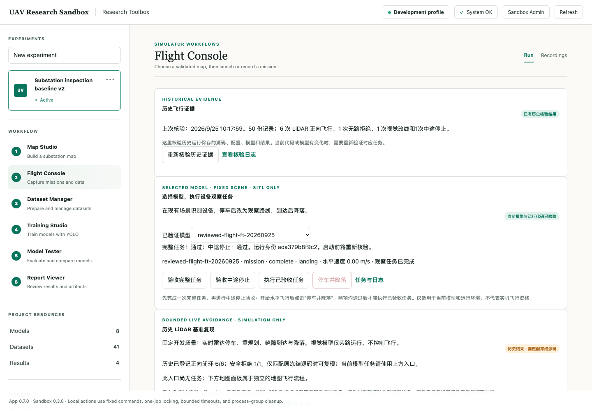

<div align="center">

# UAV Research Sandbox

**面向变电站无人机仿真与视觉模型研究的桌面沙盒**

规划路线 · 飞行采集 · 审核标注 · 训练比较 · 仿真验收

[](https://github.com/Xieyizhou/substation-uav-ml-research/actions/workflows/ci.yml)


[English](README.md) · [快速开始](#运行-demo) · [完整验收说明](docs/VALIDATION.md) · [CLI 参考](docs/CLI_REFERENCE.md)

</div>



*2026-09-25 本机桌面验收实拍。截图中的模型、数据集与飞行回执是本地研究资产，不随源码提供。*

## 这是什么

这个项目把 **PX4 SITL / Gazebo 仿真、A\* 路径规划与视觉模型迭代**放进同一个本地工作区。
可以使用桌面浏览器、可选的 macOS 原生外壳，或统一 CLI 操作。

当前定位为**研究预览版**：Demo 可以直接体验；训练和仿真需要自行安装依赖并准备相应资产。
项目没有经过真机或带电变电站验证。

## 桌面工作流

| 工作区 | 用途 |
| --- | --- |
| **Map Studio** | 编辑地图、检查路线，生成不可变地图版本。 |
| **Flight Console** | 执行受管仿真、查看轨迹，停车并受控降落。 |
| **Dataset Manager** | 查看反馈图片，逐张接纳或拒绝标注，注册数据集版本。 |
| **Training Studio** | 在预算内训练 YOLO、从已验证父模型微调，导出 ONNX。 |
| **Model Tester** | 检查候选模型与图片预测；macOS 外壳提供本地图片导入。 |
| **Report Viewer** | 查看评估、日志与带身份校验的结果回执。 |


预测只作为待审核草稿。模型任务需要对当前运行身份分别完成完整任务、中途停止两项验收；
绑定的代码、模型或环境变化后，需要重新验收。自定义地图飞行与当前固定场景模型任务是两个独立流程。

## 运行 Demo

需要 **Git、Python 3.11+ 和桌面浏览器**，启动脚本适用于 macOS / Linux。
Demo 不需要额外 Python 包、模型权重、数据集、PX4 或 Gazebo。

```sh
git clone https://github.com/Xieyizhou/substation-uav-ml-research.git
cd substation-uav-ml-research
./scripts/run_sandbox_app.sh
```

打开 **[localhost:8765](http://127.0.0.1:8765/#results/acceptance)**，进入
**Acceptance → Demo classifier → Create recipe and run**。
这是演示配方和回执的确定性合成例子，不代表真实检测精度。终端按 `Ctrl-C` 停止服务。

也可以从 CLI 执行：

```sh
python3 main.py sandbox --profile demo demo-run --output outputs/sandbox/demo/runs/first
python3 main.py sandbox --profile demo demo-inspect --input outputs/sandbox/demo/runs/first
```

[首次使用与排错 →](docs/SANDBOX_QUICKSTART.md)

## 选择研究环境

| 模式 | 额外要求 | 可以做什么 |
| --- | --- | --- |
| **Demo** | 无 | 合成流程演示，无真实训练或飞行。 |
| **Development · 离线** | 核心与 ML 依赖、自备并审核的 YOLO 数据 | 训练、ONNX 检查、回放与比较。 |
| **Development · 仿真** | 兼容的 PX4/Gazebo、模型、数据及场景资产 | 地图飞行、采集与固定场景模型闭环。 |
| **Formal** | 冻结资产与对应实验协议 | 保持证据身份的评估，不是航空器认证。 |

开发环境使用 **Python 3.12+**；本地 ML 验收使用 Python 3.14。

```sh
python3 -m venv .venv
source .venv/bin/activate
python -m pip install -r requirements.txt
# 使用真实视觉训练时再安装；先查看兼容性说明。
python -m pip install -r requirements-ml.txt
./scripts/run_sandbox_app.sh --profile development
```

ML 固定版本的本地验证环境是 **Python 3.14 / macOS arm64**，与 Demo、核心 CI 矩阵分开。
源码不含权重、原始数据、PX4/Gazebo 或作者的冻结证据包；缺少这些输入时，相应高级功能不能直接执行。
项目不会自动下载完整研究环境。

[依赖与资产边界](docs/RESEARCH_PREVIEW.md) · [模型工作台](docs/RESEARCH_INSPECTOR.md) ·
[模型与飞行验收](docs/VALIDATION.md#桌面反馈迭代)

可选 macOS 外壳需完整 Xcode：

```sh
./scripts/build_macos_app.sh release
open "dist/UAV Research Sandbox.app"
```

原生 Demo 无需 Python 或仓库；开发与正式模式依赖外部环境。本地构建为 ad-hoc 签名，未经过 Apple 公证。
旧的预发布安装包不一定对应当前源码，详见 [macOS 指南](docs/MACOS_APP.md)。

## 已验证到什么程度

| 证据 | 结果与边界 |
| --- | --- |
| 9 月 25 日独立源码验收 | 核心 **974 项通过**，没有 ML 环境；最新 CI 见页首链接。 |
| 9 月 25 日本地完整研究环境 | **2,093 项通过**；依赖本地资产的研究测试不属于纯源码 CI。 |
| 桌面闭环 | 采集 51 帧，AI 辅助显式审核接纳 46 帧、拒绝 5 帧；完成注册、微调、比较和固定场景飞行。 |
| 模型比较 | 同一 64 张开发验证集上 Macro-F1 从 **0.970238 变为 0.968013**，没有提升。 |
| 当前运行资格 | 完整任务和中途停止验收通过；一次后续任务因视觉复核中止并安全降落，同配置复跑完成。未做统计成功率承诺。 |
| 历史证据 | 重新核验 50 份原始记录；历史通过不代表新代码、新模型获得运行资格。 |

[完整报告与精确身份 →](docs/results/sandbox_core_completion_20260925.md)

范围限于桌面与仿真，不包括手机界面、真机资格或真实图像泛化证明。
反馈审核使用 AI 辅助，不是独立人工标注；保留的基础验证划分也不证明不同物理场景相互独立。

## 开发与检查

完整核心测试需要 Python 3.12+；Demo 仍支持 Python 3.11。

```sh
python3 -m venv .venv
source .venv/bin/activate
python -m pip install -r requirements-test.txt
python scripts/run_tests.py --suite core --report outputs/core-tests.json
```

CI 覆盖无依赖 Demo、核心测试及 macOS 测试、构建和打包；不会运行仿真飞行或复现完整历史训练。
详见 [测试说明](docs/VALIDATION.md) 与 [贡献指南](CONTRIBUTING.md)。

活跃实现位于 `src/`，桌面外壳位于 `apps/macos/`；`config/` 和 `simulation/` 保存定义，
`archive/research_scripts/` 保留历史脚本，`docs/` 保存指南与带日期的研究报告。

```sh
python3 scripts/export_source.py --output dist/source.zip
```

以上命令生成含文件哈希清单的轻量源码包，排除本地数据集、权重、环境和运行输出。

## 来源与许可

项目自有代码沿用前身 [uav-path-planning-demo](https://github.com/Xieyizhou/uav-path-planning-demo)
的 [MIT 许可](LICENSE)。外部依赖和资产各有许可，尤其可选 Ultralytics 使用 AGPL-3.0，
不会被本项目重新许可为 MIT。详见 [来源说明](PROVENANCE.md) 和 [第三方说明](THIRD_PARTY_NOTICES.md)。
